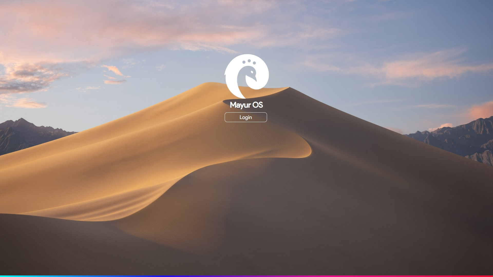
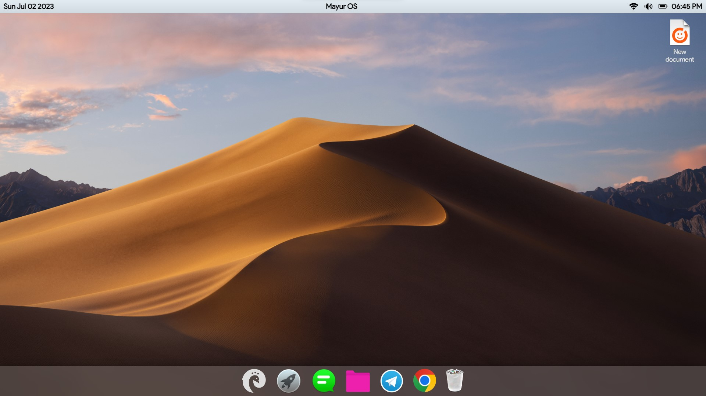
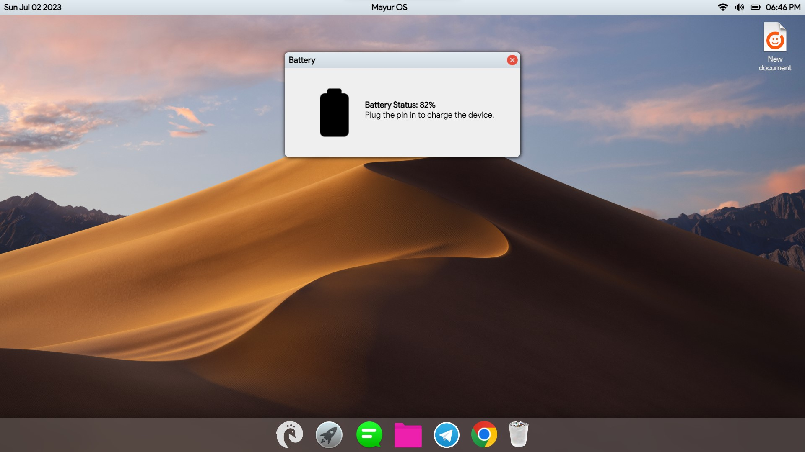
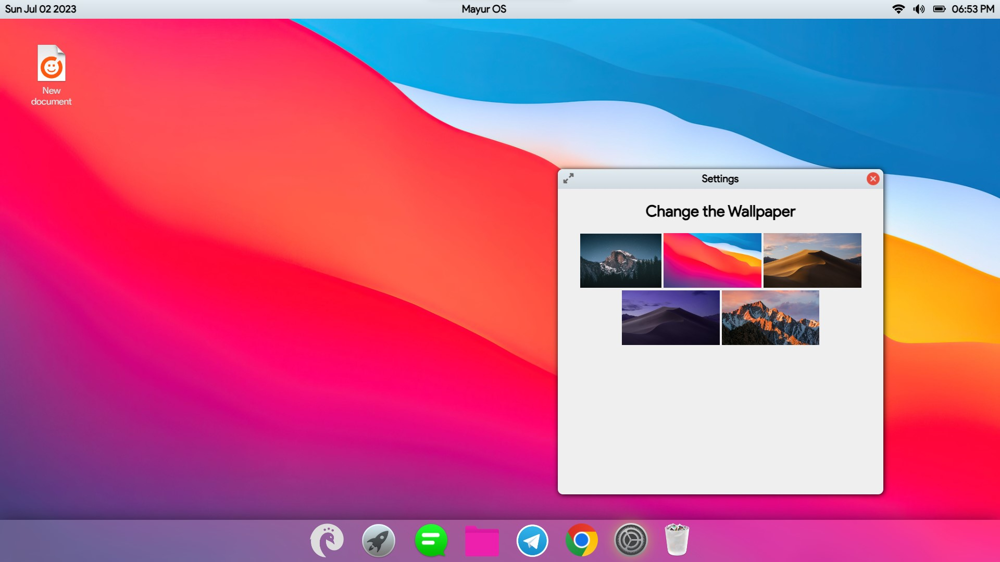

<h1 align="center">Mayur OS</h1>

  <b>Mayur OS is light weight operating system written in javascript.</b>

 

<h3>Running on localhost:8000</h3>

- Booting screen:

- Home screen:

- Battery status:

- Settings:

